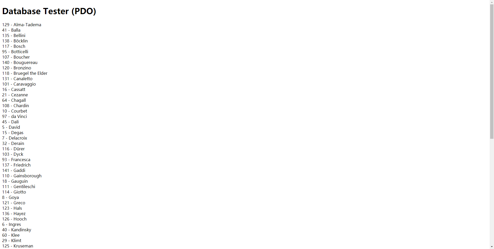
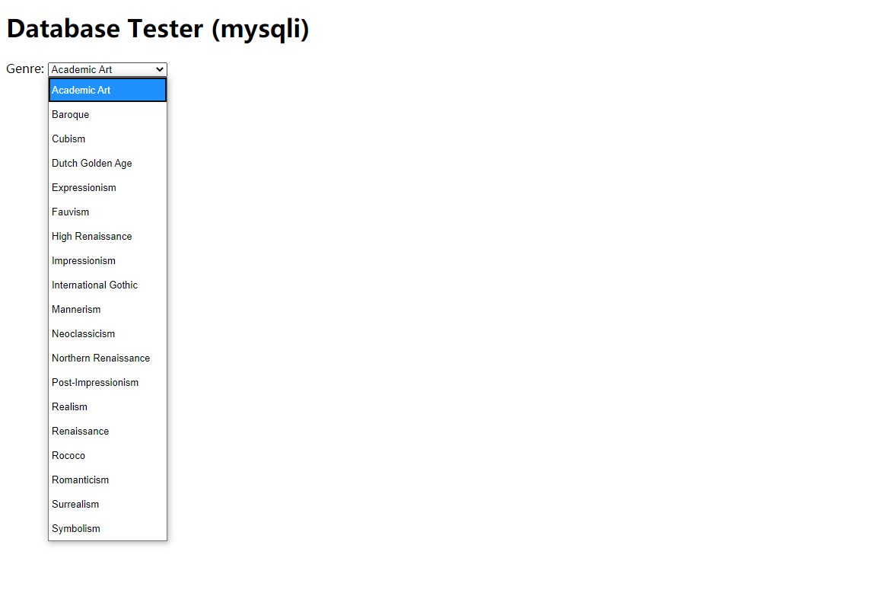
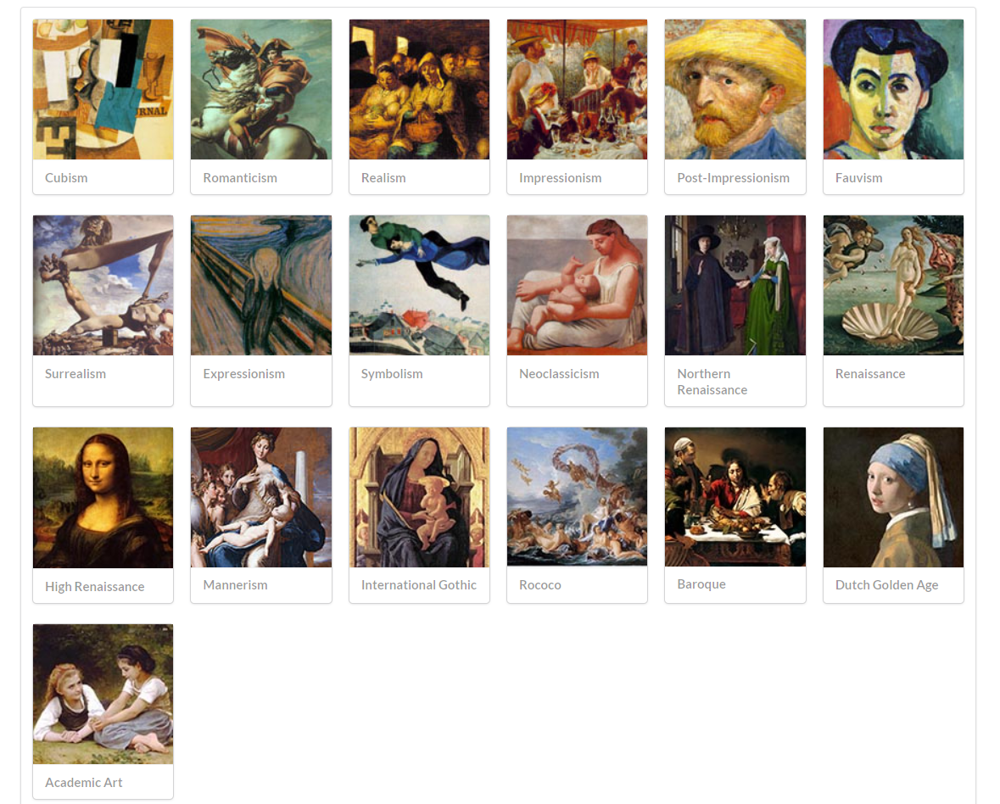
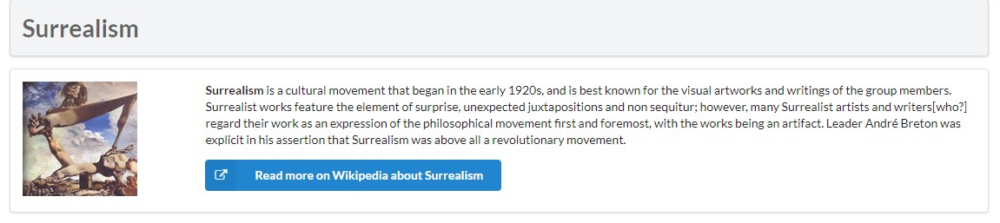

# SOFT130002_lab10

2020年Web应用基础 lab10

19302010020 袁逸聪

## exercise7连接数据库



参数在config.php中以预先定义好

```PHP
<?php
define('DBHOST', 'localhost');
define('DBNAME', 'art');
define('DBUSER', 'testUser');
define('DBPASS', 'qwertyuiop');
define('DBCONNSTRING','mysql:dbname=art;charset=utf8mb4;');
?>
```

因此需要在使用前先引入，之后便可以直接调用变量

```PHP
<?php require_once('config.php'); ?>
```

### PDO

PDO(PHP Data Objects),PHP中连接数据库的接口

#### 连接数据库

通过创建PDO类的实例完成连接：$var = new PDO('mysql:host=localhost;dbname=test', $user, $pass);

第一个参数指定了主机与数据库名称

第二个参数输入用户名

第三个参数输入用户密码

```PHP
<?php
try {
  $pdo = new PDO(DBCONNSTRING,DBUSER,DBPASS);  
  ...}
```
  
此时已连接数据库，但连接出错时将抛出PDOException异常对象，因而用try-catch代码块包裹

```PHP
try{...}catch (PDOException $e) { 
    die( $e->getMessage() );
}
```

使用结束后，也可以用$var=null来删除所有引用，否则连接在PHP脚本结束时才会关闭

#### 错误处理模式

```PHP
  $pdo->setAttribute(PDO::ATTR_ERRMODE, PDO::ERRMODE_EXCEPTION);  
```

通过调用PDO对象的setAttribute函数，自定义错误处理模式

[PHP官网对于错误处理模式的说明](https://www.php.net/manual/zh/pdo.error-handling.php?_blank)

#### 数据库搜索

```PHP
  $sql = "select * from Artists order by LastName";
  $result = $pdo->query($sql);
```

前一句定义了将在MySQL中检索所使用的语句

再使用PDO对象的query方法，得到PDOStatement形式的返回值(失败返回false)
  
#### 搜索结果显示

```PHP
  while ($row = $result->fetch()) {
      echo $row['ArtistID'] . " - " . $row['LastName'] . "<br/>"; 
  }
  $pdo = null; 
}
```

PDOStatament对象的fetch方法，将检索结果的下一条返回(失败时返回false，也就意味着读取结束)

每行读取中打印相应的ArtistID属性、LastName属性，故运行结果为打印出多行数据

结束后删除引用，释放链接

### mysqli



#### 链接数据库

类似于PDO，mysqli也有创建数据库连接的方法

但在参数上略有不同，将主机、数据库名拆开分别作为首、末参数

```PHP
$connection = mysqli_connect(DBHOST, DBUSER, DBPASS, DBNAME);
```

#### 错误处理

创建链接时，成功与否将反映在mysqli_connect_error()上

成功则返回0，失败将返回相应的错误数值

```PHP
if ( mysqli_connect_errno() ){
	die( mysqli_connect_error() );
	}
```

如果检测出错误，则结束脚本进程并提示错误数值

#### 数据库搜索

```PHP
$sql = "select * from Genres order by GenreName";
$result = mysqli_query($connection, $sql);
```

同样，利用MySQL检索语句进行搜索，只不过从PDO->query()方法变为mysqli_query(数据库链接,检索语句)方法

返回值为mysqli_result对象，失败返回false

#### 搜索结果显示

```PHP
while($row = mysqli_fetch_assoc($result)) {
	echo '<option value="' . $row['GenreID'] . '">';
    echo $row['GenreName'];
    echo "</option>";
    }
```

同样使用循环，但将检索结果写为option标签

结束后，同样要关闭(result对象以及数据库连接)

```PHP
if(...){...
    mysqli_free_result($result);
	}
mysqli_close($connection);
```

## exercise8

！[exe8_1](./figures/3.png)

### html结构与函数定位

左边为画家选择区，与outputArtists()联动

右边为展示区，根据选择，与OutputPaintings()联动，展示结果

而outputSinglePainting()封装一部分代码，由putputPaintings()调用

### outputArtists()

采用PDO方式连接数据库

```PHP
"$sql = select * from Artists order by LastName limit 0,30";
$result = $pdo->query($sql);
```

按名字排序，检索了Artists数据库中的30位艺术家

打印a标签与exe7类似

但exe8加入了active检测，赋予选中条目不同的样式

```PHP
echo '<a ... "class="';
if (isset($_GET['id']) && $_GET['id'] == $row['ArtistID']) echo 'active ';
```

其中$_GET使用超全局变量，获取url参数传递内容

### outputPaintings()

采用PDO方式连接数据库

根据url参数，检索对应艺术家的数据

检索结果每一行包含一幅作品，传参给outputSinglePainting()输出

### outputSinglePainting()

多个echo输出图片、标题、摘要与相应html元素

## exercise9

PDO::prepare(sql检索语句)返回PDOStatement对象，但并不马上执行

PDOStatement::bindValue('名',值)则可以才prepare之后赋值，改变sql检索语句实际内容

PDOStatement::execute()最终执行，得到检索结果

此方法可以不必在一开始确定检索语句，先准备语句大概结构，随后确定具体内容

[PHP官网对PDOStatement::execute()使用方法详述](https://www.php.net/manual/zh/pdostatement.execute.php_blank)

## exercise10





### outputGenres()

连接数据库、拿到genre信息，循环中每个都传参给outputSingleGenre()

### outputSingleGenre()

echo出html结构、图片内容

### constructGenreLink($id,$label)

为传入的label(html元素)添加a标签框

并添加链接，跳转到对应详细页面

