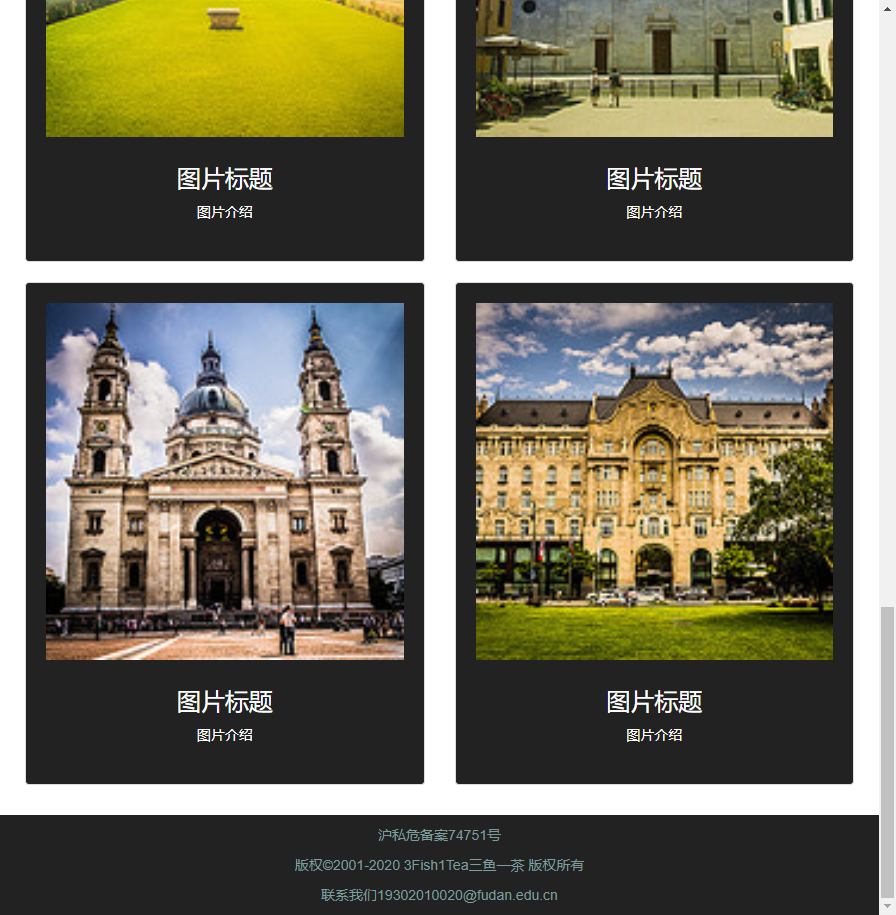

# Lab4设计文档
袁逸聪 19302010020
--------
## 结构思路
1、导航栏

[boostrap3官网-组件-导航条](https://v3.bootcss.com/components/#navbar)

lab4不需要模板中那么多链接，但删除多余的部分后右边的个人中心会跑到左边

这时需要把.navbar-right的列表从上级列表中取出，bootstrap已经做好将它放在右边的设置（用margin实现，只能设置一个）

个人中心需要在条目前加上图标，在对应条目的li元素中添加

2、轮播图片

[bootstrap3官网-JavaScript插件-Carousel](https://v3.bootcss.com/javascript/#carousel)

模板很好用，几乎没有什么需要修改的地方。

只要设定图片的src，微调字体即可。

3、热门图片快速浏览

[boostrap3官网-组件-缩略图](https://v3.bootcss.com/components/#thumbnails)

模板的表现需要调整，设定自己想要的各个margin、padding、每行栏数、图片与文字在格内的布局。

比较头疼的是row会使浏览器右边多出一条空白，需要在父容器添加overflow-x：hidden去除。但如果和导航栏共用一个父容器，会破坏导航栏下拉菜单的效果，所以需要分开设定。

4、页脚

丢三个row上去，使用bootstrap而和pj中的效果保持一致。

## 效果图
第一张

第二张]

第三张

------
